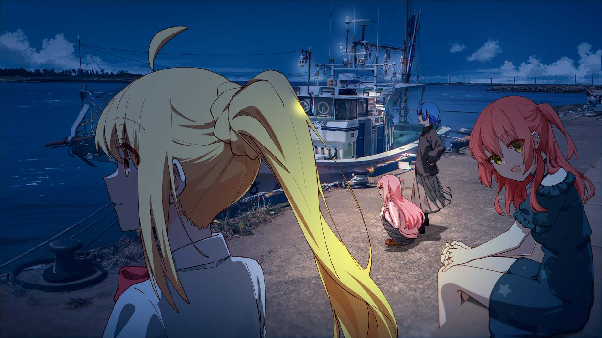

> [!TIP]
> 观尘世，绘繁星，游戏成诗，情暖万千灵魂

> [!NOTE]
> 永恒令时间无限延展，梦想使每一个刻度都熠熠生辉。      ----雷电真《原神》
>
> 世间存在一种羁绊。我的生命中的每一点都通过这种羁绊彼此相连。这种羁绊就在那里，我们只需要天马行空般地去想象。      ----Peter Handke

联系: [Twitter（X）](https://x.com/starrysky_fy)

邮件：xiaoyuesun915@gmail.com | starrytracesky@outlook.com

# 自述（wink~）

作为一枚中二的大学INFP📘 

- 🎮极度沉迷二次元，游戏开发，MR, BCI！
- 天天泡在（bushi） 幻想 | 写作 | 绘画 | Unity | Unreal | AI | ACGN

[📖「Notes」星途-Notion笔记](https://yumihoshi.notion.site/Notes-1ea5e9d8b4b04d0888db741d8014b091?pvs=4)

# 未来畅想（We Just Need To Imagine Freely）

> [!NOTE]
> 唔，想融合AI，二次元到游戏开发中，以及更多元素！
> 
> 讲述一个好故事，治愈系，如果说具体表现的话，就是二次元动漫一样的世界！

如果可能的话，做个SAO也是非常棒的 :electron:

### ACG 计数器

