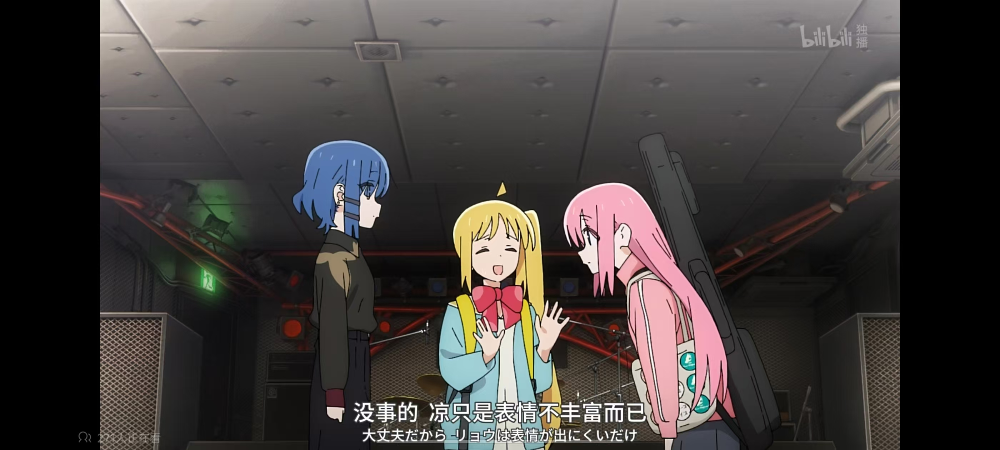

> 永恒令时间无限延展，梦想使每一个刻度都熠熠生辉。      ----雷电真《原神》

> 世间存在一种羁绊。我的生命中的每一点都通过这种羁绊彼此相连。这种羁绊就在那里，我们只需要天马行空般地去想象。      ----Peter Handke

联系: [Twitter（X）](https://x.com/starrysky_fy)

邮件：xiaoyuesun915@gmail.com | starrytracesky@outlook.com

# 自述（唔哇）

作为一枚中二的大学INFJ📘 

- 🎮非常喜欢游戏开发，如果是VR就最好啦
- 目前正在学习 C# | C++/C | Unity | Unreal | Godot
- 热衷于研究 VR | Unity | Unreal | stable diffusion | ACG
- 很想尝试绘画之类的

[📖我的 Notion 笔记](https://starrytracesky.notion.site/1ea5e9d8b4b04d0888db741d8014b091?pvs=4)

[📖我的博客](https://www.cnblogs.com/starrysky-skyler)

# 未来畅想（We Just Need To Imagine Freely）

唔，想融合AI，二次元到游戏开发中，以及更多元素！
讲述一个好故事，治愈系，如果说具体表现的话，就是二次元动漫一样的世界！

如果可能的话，做个SAO也是非常棒的 :electron:

### ACG 计数器

